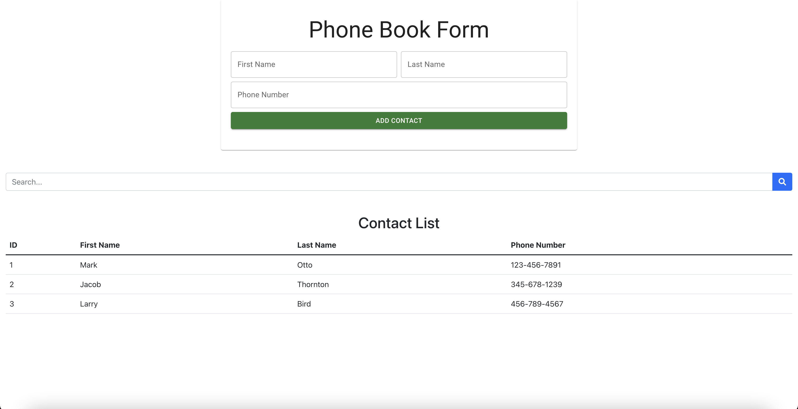

# A simplified Phone Book Application built with React

## Project Description

- The user can enter new contact first name, last name, and phone number. All fields are required to be filled in.
- The phone number format is ###-###-####.
- After clicking Add Contact button, the new contact will be added to the Phone Book List Table if the phone number is not already existed.
- All of the contacts will be displayed in this Contact List Table.
- Search for phone number or names by typing in the keyword in the search box.

## Project View

### Bootstrap

### MaterialUI + React Hook Form

## Features

- Written in modern React, only functional components with hooks.
- Used state management redux.
- Created Form with Material UI, React Hook Form and validation with Yup.

## How to setup

Given node and npm is available, in the project directory, you can run the following commands:

### `git clone https://github.com/camha91/phone-book-app.git`

### `npm install`

### `npm start`

Runs the app in the development mode.\
Open [http://localhost:3000](http://localhost:3000) to view it in your browser.

The page will reload when you make changes.\
You may also see any lint errors in the console.
