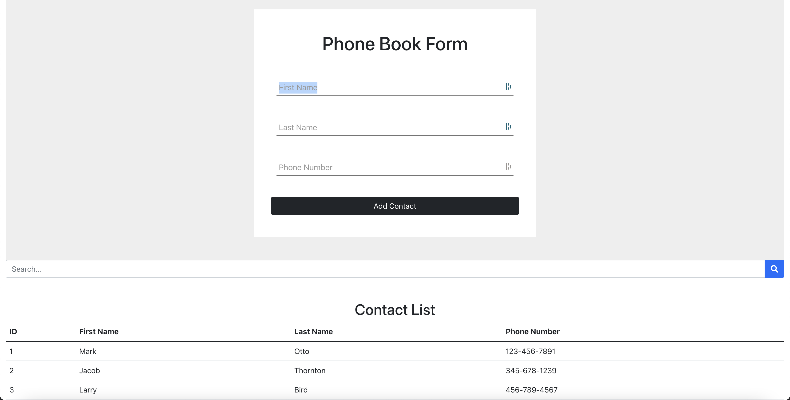

# Getting Started with Create React App

This project was bootstrapped with [Create React App](https://github.com/facebook/create-react-app).

## Project Description

This project is a simple phone book application written using React, React Hooks, and state management Redux.
The user can enter new contact first name, last name, and phone number. All fields are required to be filled in.
The phone number format is ###-###-####.
After clicking Add Contact button, the new contact will be added to the Phone Book List Table if the phone number is not already existed.
All of the contacts will be displayed in this Phone Book List Table.
The user will also be able to search for phone number or names by typing in the keyword in the search box.

## Project View

## Available Scripts

In the project directory, you can run:

### `npm start`

Runs the app in the development mode.\
Open [http://localhost:3000](http://localhost:3000) to view it in your browser.

The page will reload when you make changes.\
You may also see any lint errors in the console.
